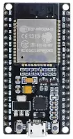
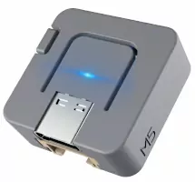
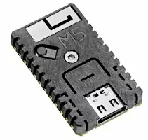

# Template Platformio ESP32 ESP IDF project

## Features

* nice boot log
* modular structure (separate files/tasks/"services")
* device status signalization using RGB LED (where available)
* wifi connection (station or AP)
* supported boards:
  * [Generic ESP32 dev board](https://docs.platformio.org/en/latest/boards/espressif32/esp32dev.html)
  * [M5Stack ATOM Lite](https://docs.m5stack.com/en/core/ATOM%20Lite)
  * [M5Stack STAMP-C3](https://docs.m5stack.com/en/core/stamp_c3) (with custom board file installed)

  

It's easy to add support for any PlatformIO-supported ESP32 board by editing `platformio.ini`.
See [PlatformIO documentation](https://docs.platformio.org/en/latest/projectconf/index.html)

## Prerequisites

* PlatformIO installed

## Quickstart

ESP32dev board:
```!sh
$ make build install monitor
```

M5Stack Atom:
```!sh
$ PIO_ENV=m5stack-atom make build install monitor
```

M5Stack STAMP-C3:
```!sh
$ PIO_ENV=m5stamp-c3 make build install monitor
```

Or you can use PlatformIO directly:

```!sh
$ pio run -e m5stack-atom -t upload
$ pio device monitor -e m5stack-atom
```

This commands will download all needed tools and libraries, build the application
and upload it to the MCU.

## M5Stack STAMP-C3

M5Stack STAMP-C3 is not officially supported by PlatformIO yet. You must copy a
board definition file to the PlatformIO root before compilation.

On Linux:

```!sh
$ mkdir ~/.platformio/boards
$ cp local_m5stamp_c3.json ~/.platformio/boards/
```

For installation on other platforms, see [PlatformIO documentation on custom boards definition](https://docs.platformio.org/en/latest/platforms/creating_board.html).
